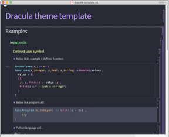

# Dracula for [Wolfram Notebooks](https://www.wolfram.com/notebooks/)
> A dark theme for [Wolfram Notebooks](https://www.wolfram.com/notebooks/)

 
 
 

## Install
All instructions can be found at [draculatheme.com/wolfram-notebooks](https://draculatheme.com/wolfram-notebooks).

## Team
This theme is maintained by the following person(s) and a bunch of
[awesome contributors](https://github.com/dracula/wolfram-notebooks/graphs/contributors).

 |
--- |
[Jesse Dohmann](https://github.com/jldohmann) |

## License

[MIT License](./LICENSE)
